# vigil

[](https://github.com/Deewakarmishra/vigil/actions/workflows/ci.yml)

A self-hosted **AML alert-triage & SAR-drafting agent**. It reads a
transaction-monitoring alert the way a senior analyst would — enriching it with
the customer's KYC, behavioral baseline, counterparties, and prior cases — then
**clears the false positive with a regulator-readable cited rationale** or
**escalates the real one with an evidence-indexed SAR narrative**, where **every
typology claim is bound to the transaction that proves it**. The agent
**proposes; a compliance officer disposes and files** — the service role
literally cannot file a SAR or restrict an account. Auto-clears always write a
full cited rationale (never a silent drop), the audit trail is hash-chained, and
the eval harness reports **false-positive reduction at a fixed false-negative
rate** — recall is never traded for a prettier number.

This is the **Vigil** demo in the [Agent Studio](../demo-studio) — the
trust flagship, the fifth of five vertical agents built on a single shared spine
(ingest → hybrid retrieval → agent loop → typed scope contract → policy engine →
HITL → audit → eval).

## Problem domain

AML is the highest-stakes drudgery in finance: **90–95% of monitoring alerts are
false positives** (sanctions screening up to 99.5%), each alert costs $25–50 to
clear, a single SAR can take up to 22 hours end-to-end, and global AML compliance
runs >$274B/yr — most of it spent clearing noise. SAR filings hit a record ~4.1M
in 2025, backlogs are themselves an examination finding, and TD Bank paid $3.09B
in 2024 for unheeded alerts and unfiled SARs. The work is mechanical — match the
customer's behavior against known typologies and decide — but a missed true
positive is a regulatory failure and a late appeal is lost.

This repo is a reference implementation of an agent that does the mechanical part
correctly and leaves the decision to a human:

- **Enrichment, not a bare alert.** Each alert is loaded with the customer's KYC,
  the transaction lookback, counterparties, and a per-customer behavioral
  baseline.
- **Baseline-vs-observed.** Per-customer scoring (not a universal threshold) is
  *how* AI cuts the false-positive rate: a legitimate spike within the customer's
  own ceiling reads as explained; an out-of-pattern one does not. This feeds a
  continuous **suspicion score** in `[0, 1]`, blended with the strongest typology
  signal and weighted by the customer's risk rating / PEP status.
- **A versioned, content-hashed typology library.** Detection thresholds live in
  data (`typologies/library.yaml`), not code — each typology declares its own
  lookback window, and the library's SHA-256 is written into every audit row, so a
  disposition is permanently tied to the rule version that produced it.
- **Windowed detection.** Each typology only looks back over its own
  `window_days`, and the transaction read is bounded by `max_lookback_days`, so a
  customer clean today does not flag for activity from long ago — and the query
  stays cheap at scale.
- **Typology detection, evidence-bound.** Deterministic detectors for
  structuring, layering / rapid-movement, and mule funnels — each firing only with
  the **transactions that prove it** attached (locator + quote), and layering
  requiring genuine *in-then-out* ordering (outflows after the inflow).
- **The citation guardrail.** `reflect` drops any typology hypothesis it cannot
  evidence; no narrative claim survives without a transaction behind it; the eval
  harness measures citation precision.
- **Recall is protected first.** The disposition order puts the typology check
  *before* any clear, so a suspicious alert can never be auto-cleared — the eval's
  false-negative gate is zero-tolerance.
- **The headline is computed, not asserted.** The eval sweeps a clear threshold
  over the suspicion score and reports the maximum **false-positive reduction at a
  fixed false-negative rate of zero** — plus the operating threshold and the
  separation margin between benign and suspicious. It is an actual swept curve, not
  a single point.
- **Auto-clear writes a cited rationale.** A false positive is cleared with a
  full, stored rationale in the disposition's reasoning trace — never a silent
  drop (the TD-Bank failure mode).
- **SAR drafting.** Escalations carry a regulator-readable 5W narrative with an
  evidence index mapping each claim to its transactions — never auto-filed.
- **The officer gate.** The agent recommends; a compliance officer disposes and
  files. No adapter files a SAR or freezes an account autonomously.
- **Immutable audit + reasoning-trace store.** SHA-256 hash-chained audit and the
  full agent trace per alert — the artifact an examiner asks for.
- **Mock-first.** TM, ledger, and case-management connectors and the LLM default
  to deterministic mocks, so the whole thing runs on a synthetic bank with
  **zero API keys and zero real financial data.**

## Architecture

```mermaid
flowchart LR
  A[TM alert<br/>rule · customer] --> B[Enrich<br/>KYC · baseline · counterparties · priors]
  B --> C[Detect typologies<br/>structuring · layering · mule]
  C --> D[Cite each claim ↔ transactions]
  D --> E[Reflect<br/>drop any uncited claim]
  E --> F[Assess baseline + score<br/>deviation × typology × risk → suspicion]
  F --> G[Dispose<br/>clear / escalate / RFI]
  G --> H[(AlertScope<br/>typed contract)]
  H --> I[Policy engine<br/>first-match-wins]
  I -->|baseline-explained| J[Auto-clear + stored cited rationale]
  I -->|typology evidenced| K[Escalate → officer + SAR draft]
  I -->|missing KYC| L[Request-for-information]
  K --> M[Compliance officer: dispose + file]
  J --> N[(Hash-chained audit + reasoning trace)]
  M --> N
  H --> O[Eval harness<br/>FP@FN threshold sweep]
  N --> P[Operator console — Alert-Disposition view]
```



The agent emits a typed **`AlertScope`** — the structured artifact every Studio
agent produces (Tend's `JobScope`, Aftercare's `CaseScope`, Frontline's
`ServiceScope`, Casewise's `MatterScope`, Authora's `AuthScope`, …). It carries
the enrichment, the evidenced typology hypotheses, the disposition + confidence,
the cited rationale, and (on escalation) the SAR narrative. The policy engine
routes on it; the console renders it as the Alert-Disposition view; the eval
harness scores it.

## Layout

```
src/vigil/
  config/         pydantic-settings + structlog setup
  db/             SQLAlchemy 2.0 base, engine, session_scope, bootstrap
  models/         customers, kyc_profiles, counterparties, transactions,
                  customer_baselines, alerts, typology_hypotheses,
                  alert_evidence (citation join), dispositions, sar_drafts,
                  review_tasks, eval_runs/cases, audit_logs, policy_definitions
  security/       Fernet credential cipher, bcrypt passwords
  contracts/      AlertScope + TypologyClaim, TxnCitation, SARNarrative, Enrichment
  detection.py    typology detectors (structuring/layering/mule) + baseline (pure)
  scoring.py      continuous suspicion score (baseline deviation × typology × risk)
  typology_library.py  loads the versioned, content-hashed typology parameters
  typologies/     library.yaml — detection thresholds as tunable, hashed data
  sar.py          5W SAR narrative + evidence index (pure)
  providers/      LLM client (mock-first; real model behind USE_LLM)
  retrieval/      deterministic embeddings (production swaps pg_trgm + pgvector)
  agent/          steps (enrich · hypothesize · reflect · dispose), loop
                  (build_alert_scope), runner (route + act + audit)
  policy/         domain-agnostic first-match-wins engine + YAML loader
  services/       hash-chained audit log (write + verify_chain)
  synthetic/      deterministic bank + alerts (seed AND eval ground truth)
  eval/           metrics (incl. the FP@FN sweep) + backtest harness
  mcp_server.py   optional Model Context Protocol server (read-only triage tools)
  api/            FastAPI console (dashboard, alerts, the Alert-Disposition view,
                  SAR, officer queue, eval, sources, audit) + Jinja2 + HTMX
  cli/            Typer CLI: version, db-init, demo, eval, serve, worker

policies/         routing.yaml (mirrors DEFAULT_RULES; per-tenant override)
tests/            unit (detection, policy, scope, SAR) + integration
```

## Stack

- Python 3.11+ (dev venv on 3.12)
- FastAPI · Uvicorn · Jinja2 · HTMX
- SQLAlchemy 2.0 · Alembic · PostgreSQL 16
- Redis 7 · RQ (production async path; the demo triages inline)
- pydantic 2 · pydantic-settings · structlog
- cryptography (Fernet) · bcrypt
- httpx · tenacity · PyYAML
- Typer · Rich
- pytest · ruff · black · mypy
- Optional `llm` extra: anthropic · sentence-transformers
- Production add-ons (not needed for the demo): pg_trgm + pgvector, partitioned
  transaction tables, TM-engine / ledger / case-system connectors, FinCEN BSA
  E-Filing draft export

## Quickstart

The demo needs only a local PostgreSQL. No Docker, no Redis, no API keys, no real
financial data.

### 1) Set up the environment

```
cp .env.example .env
make install
```

`.env.example` keeps `CONNECTOR_MODE=mock` and `USE_LLM=false`, so the platform
runs end-to-end with deterministic mocks. Point `POSTGRES_*` at any local
Postgres — the demo creates the database if it's missing.

### 2) Seed a synthetic bank + triage every alert

```
make demo
```

This rebuilds a clean schema, seeds *Meridian Bank* (customers, KYC, baselines,
transaction histories) and 11 monitoring alerts with **planted typologies**
(structuring, layering, rapid cross-border movement, a mule funnel) and **planted
false positives** (a retail spike, a high-volume payroll processor, recurring
round-number vendor payments, a common-name sanctions hit, a sub-pattern cash
deposit) — plus a non-typology, out-of-baseline wire that escalates on suspicion
score alone — then triages each end-to-end and prints the disposition table
(reason, typologies, disposition, confidence, route). Re-running is reproducible by
default; pass `--keep` to preserve existing data.

### 3) Backtest the agent

```
make eval
```

Backtests over the labeled synthetic bank and prints the metrics — headlined by
**false-positive reduction at a fixed false-negative rate**, computed by sweeping a
clear threshold over the suspicion score and reading off the operating point where
no suspicious alert is cleared. It then prints the sweep curve, the separation
margin, and loudly flags any false negative (a suspicious alert cleared) or routing
miss.

### 4) Explore the operator console

```
make serve
```

Open `http://localhost:8000`:

- **Dashboard** — alert volume, auto-clear rate, escalations, SAR drafts, RFI,
  oldest item in the backlog.
- **Alerts** → **the Alert-Disposition view** — the recommended disposition + the
  cited rationale, each typology hypothesis with the **exact transactions** behind
  it, and the baseline-vs-observed context.
- **SAR draft** — the 5W narrative + evidence index; review-and-file (officer).
- **Officer queue** — escalations + RFIs awaiting disposition.
- **Eval** — the latest backtest, alert by alert.
- **Sources** — which connectors are live vs. mock.
- **Audit** — the hash-chained log with a chain-integrity check.

## CLI

```
vigil --help
vigil version
vigil db-init                  # create the database (if missing) + all tables
vigil demo                     # clean rebuild + seed + triage every alert
vigil demo --keep              # seed/triage without resetting the schema
vigil eval                     # backtest over labeled synthetic alerts
vigil serve                    # run the FastAPI operator console
vigil worker                   # RQ worker (production async path)
vigil mcp                      # Model Context Protocol server (needs the [mcp] extra)
```

## Routing policy

Autonomy is governed by a first-match-wins policy (`policies/routing.yaml`,
mirroring the built-in `DEFAULT_RULES`). The engine matches a rule's `when` block
against a flat fact dict; an empty `when` always matches, so the last rule is the
default and no match fails safe to a human. `route: auto` means the agent disposed
(an auto-clear with a stored cited rationale); `route: hitl` means a compliance
officer must dispose (escalate + file) or supply information. **Recall is
protected by ordering** — the typology check precedes any clear.

```yaml
rules:
  - id: typology-likely
    when: { typology_likely: true }
    route: hitl
    reason: "evidenced typology — escalate to officer with SAR draft"
  - id: missing-kyc
    when: { has_kyc: false }
    route: hitl
    reason: "no KYC on file — request-for-information"
  - id: baseline-explained
    when: { baseline_explained: true }
    route: auto
    reason: "within customer baseline, no typology — auto-clear with stored rationale"
  - id: low-confidence
    when: { confidence_below: 0.6 }
    route: hitl
    reason: "low confidence — officer review"
  - id: default-escalate
    when: {}
    route: hitl
    reason: "unexplained — officer review"
```

Conditions support exact match plus `_below` / `_above` operators on `action`,
`disposition`, `has_kyc`, `typology_likely`, `baseline_explained`,
`suspicion_score`, and `confidence`. Tune thresholds in `.env`
(`CLEAR_THRESHOLD`, `MAX_LOOKBACK_DAYS`, `AUTO_MIN_CONFIDENCE`, `CTR_THRESHOLD`,
`BASELINE_TOLERANCE`), tune detection parameters in `typologies/library.yaml`, or
load a per-tenant `PolicyVersion` to override the routing defaults without code
changes.

## Switching to live connectors

1. Set `CONNECTOR_MODE=live` in `.env`.
2. Fill the relevant placeholders:
   - `TM_PROVIDER` (`actimize` | `unit21` | `inhouse`) + `TM_API_KEY`
   - `CASEMGMT_PROVIDER` (`fincen_efile`) + `CASEMGMT_API_KEY`
3. Generate a real `FERNET_KEY`:
   ```
   python -c "from cryptography.fernet import Fernet; print(Fernet.generate_key().decode())"
   ```

Each adapter keeps its mock fallback while its own credential is still a
placeholder, so a partial rollout works without code changes. **Filing is always
an officer action** — no adapter files a SAR or restricts an account, in any mode.

## Tests

```
make test                      # unit + integration
```

Unit tests cover the typology detectors (structuring / layering / mule, plus their
negative cases, likelihood monotonicity, the lookback window, and the layering
in-then-out ordering fix), the suspicion score and its risk weighting, the FP@FN
threshold sweep (the operating point never admits a false negative), the versioned
typology library (stable content hash, hash changes on a parameter change, default
fallback), the generic policy engine and its recall-protecting order, the
`AlertScope` contract, the disposition guardrail (a clear can never precede the
typology check), and SAR drafting (all 5W present + evidence index). The optional
MCP server test skips cleanly when the `[mcp]` extra is absent. Integration tests
spin up a throwaway `vigil_test` Postgres database, reset to a clean schema each
run, seed the synthetic bank, assert the pipeline spans cleared / escalated / RFI
outcomes, and hold the eval bar (**zero false negatives**, disposition / route
accuracy, typology recall, citation precision, SAR completeness, and full
false-positive reduction at the computed operating point). They skip automatically
if Postgres is unreachable.

## Design notes

- **Recall is protected by construction.** The disposition logic checks for an
  evidenced typology *before* it can ever clear, so a suspicious alert cannot be
  auto-cleared. The eval gates false negatives at 0 — the moral and regulatory
  core. FP reduction is only ever reported *at a fixed false-negative rate*.
- **The headline is a computed curve.** A continuous suspicion score (baseline
  deviation blended with the strongest typology signal, weighted by risk / PEP)
  lets the eval *sweep* a clear threshold and report the maximum FP reduction
  reachable with zero false negatives — with the operating threshold and the
  benign-vs-suspicious separation margin alongside it. The trade-off is a knob
  (`clear_threshold`), not a hard-coded outcome.
- **Detection is data, windowed, and hashed.** Thresholds live in
  `typologies/library.yaml`; each typology declares its own lookback window; the
  library's SHA-256 is stamped into every audit row. Tune per tenant without
  touching code, and an examiner can pin the exact parameters behind a disposition.
- **The agent proposes; the officer disposes and files.** The case-management
  adapter exposes no autonomous `file_sar`; filing is an officer route in the
  console. This is the product, not a limitation.
- **Auto-clear is never a silent drop.** Every cleared false positive writes a
  full cited rationale into the disposition's reasoning trace — the note an
  analyst would otherwise write tens of thousands of times a year.
- **Citation is the guardrail.** A typology claim survives `reflect` only with a
  bound transaction; the `alert_evidence` join persists the proof; the eval
  measures citation precision.
- **Per-customer baseline, not a universal threshold.** Observed-vs-expected on
  the customer's own ceiling is how the false-positive rate actually falls — a
  legitimate large flow within baseline reads as explained.
- **One corpus, two consumers.** `CASE_SPECS` in `synthetic/generator.py` is the
  single source of truth for the demo seed *and* the eval ground truth, so the
  showcase and the backtest can never silently disagree.
- **Audit is a hash chain, not just rows.** Each row hashes the previous row's
  hash plus its own content, so `verify_chain` detects any edit or deletion — the
  exam artifact.

## About this code

Companion demo to the vertical-agent work by
[deewakar](https://github.com/Deewakarmishra), part of the
[Agent Studio](../demo-studio). It sits on top of an existing
transaction-monitoring engine (Actimize / Unit21 / in-house) — a triage + drafting
layer, not a new monitor. The typologies are shaped after published FATF/FinCEN
patterns; the demo runs entirely on synthetic data. For paid implementation, open
an issue.
